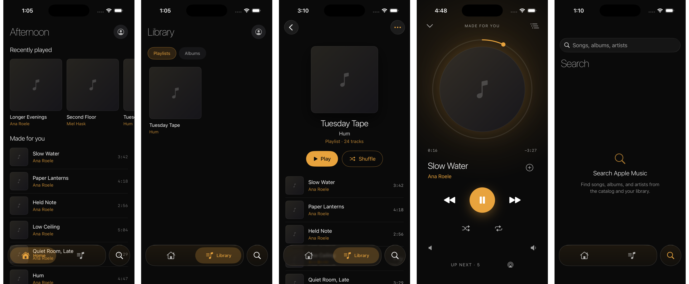
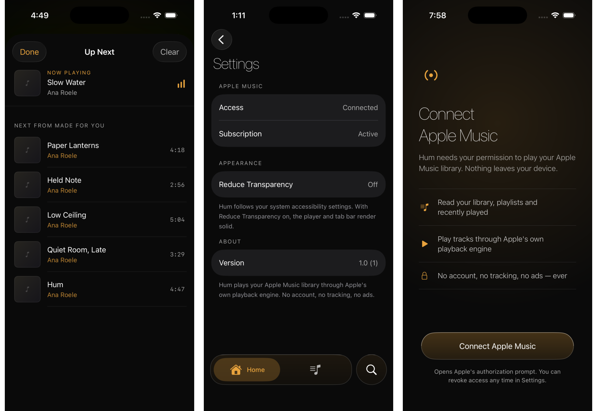

<div align="center">


# hum

**Apple Music, in glass and amber.**

A native SwiftUI player for your own Apple Music library — iOS 26 Liquid
Glass chrome, an amber-on-onyx design system, and a companion watchOS app.
No ads, no account, no third-party streaming provider.

[**Live site →**](https://suraj-shetty.github.io/HumApp/) · Swift 6 · SwiftUI · MusicKit · watchOS

</div>

<br>

<div align="center">
  
</div>

<br>

## Why Hum exists

Every third-party Apple Music client is either a paid subscription streamer
in disguise or a bare-bones utility that looks like it. Hum is neither: it
plays **your own library**, through **Apple's own playback engine**, and
spends its entire design budget on making that library nice to move
through — nothing else.

```
No ads. No account. No catalog to sell you. Just your music, better lit.
```

## What it looks like

<div align="center">
  
</div>

## The design system — Amber Glow

| Token | Value | Role |
|---|---|---|
| Deep Onyx | `#0A0A0A` | Base — every screen starts here |
| Honey Amber | `#E8A33D` | The *only* accent — artist names, progress, the play button |
| Surface Raised | `#1C1A18` | Cards, avatar chips |
| Amber Hover | `#F2B75C` | Pressed / hovered lift |

One accent color, used at four deliberate strengths, on one background.
The type ramp runs light — the heaviest non-wordmark weight in the whole
app is regular — and the same uppercase, wide-tracked overline (`RECENTLY
PLAYED`, `UP NEXT`, `MADE FOR YOU`) marks every section header, on every
screen, without exception.

## Liquid Glass, on purpose

iOS 26's glass effects are easy to overuse. Hum uses them in exactly one
place: the tab bar and the player bar live in a single
`GlassEffectContainer`, sharing one `glassEffectID`. Tap into a track and
the bar doesn't fade into Now Playing — **it morphs into it.** Everywhere
else — Now Playing, Detail, the Ad-free settings screen — the surface is
flat and opaque, because content should never fight glass for legibility.

That boundary isn't a style guide anyone has to remember. It's enforced:

```bash
# fails the build if this ever finds a hit outside GlassSurface.swift
grep -rn "glassEffect" Hum/ | grep -v DesignSystem/GlassSurface.swift
```

## What's actually running under the hood

- **Swift 6, strict concurrency, from the first commit** — not retrofitted.
  Reducers are pure `nonisolated` structs; MusicKit adapters are actors.
- **MVVM + reducer core.** `AuthReducer`, `SubscriptionReducer`, and
  `QueueReducer` are unit-tested in total isolation from MusicKit, the
  network, or a device — 50+ tests, zero UI dependency.
- **Containment by build failure, not convention.** A pre-build script
  greps the tree and fails with an Xcode-clickable error if a `Features/`
  screen imports `MusicKit` directly, or if `.glassEffect()` shows up
  outside `DesignSystem/GlassSurface.swift`.
- **Warnings are errors.** The "clean build" bar isn't discipline, it's a
  compiler flag.
- **watchOS companion**, sharing the same domain and playback layer as the
  phone app — not a second implementation of it.

## Screens

Home · Library · Search · Album Detail · Now Playing · Queue · Settings ·
Connect Apple Music (onboarding) — eight screens, one design language, zero
fixture data left in. Every screenshot above is a real device against a
real Apple Music library.

## Project layout

```
Hum/
├─ DesignSystem/     Palette, type, spacing, motion — GlassSurface.swift is the only
│                     file allowed to call .glassEffect()
├─ Domain/            Sendable value types: Track, Collection, PlaybackState, …
├─ Reducers/          Pure, tested state machines — Auth, Subscription, Queue
├─ Services/          Protocols first; Adapters/ is the only place MusicKit is imported
├─ Features/          One folder per screen — Home, Library, Search, Detail,
│                     NowPlaying, Queue, Connect, Onboarding, Settings, Root
└─ Resources/         Assets, launch screen

HumWatch/             watchOS companion target
HumTests/             Reducer + fake-service test suites
```

## Getting started

Hum needs your own Apple Music subscription — there's no key or signup for
Hum itself.

```bash
git clone https://github.com/suraj-shetty/HumApp.git
cd HumApp
open HumApp.xcodeproj
```

Build the `Hum` scheme for iOS, or `HumWatch` for the watch companion.

## Design source

The prototype that Hum's SwiftUI is reconciled against lives in
[`designs/Hum-All-Platforms.html`](designs/Hum-All-Platforms.html) — every
color, spacing, and motion value in this README was extracted from it, not
guessed.

---

<div align="center">

Built by [Suraj Shetty](https://github.com/suraj-shetty) · [suraj-shetty.github.io/HumApp](https://suraj-shetty.github.io/HumApp/)

</div>
